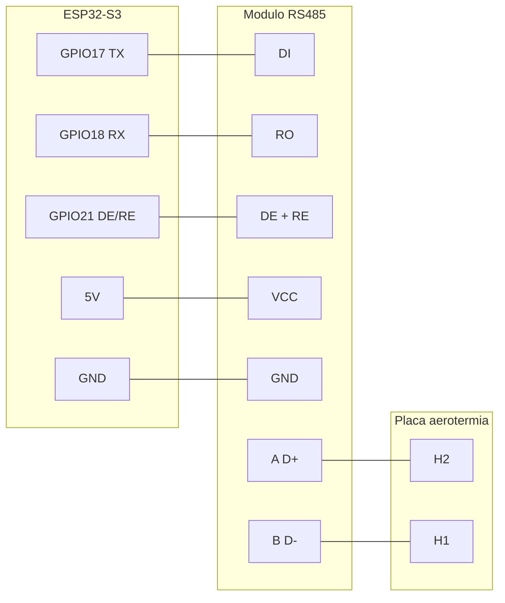

# 1) Conexiones físicas — Aerotermia Kosner AQUARIS D HT R‑290

> ⚠️ **Antes de nada, deja la máquina sin tensión.** Dentro hay 230 V y el equipo lleva refrigerante R‑290 (propano, inflamable). No abras la placa con el equipo enchufado. Si no te sientes seguro, que lo haga un instalador.

## Lo que vas a montar

Un **ESP32‑S3** habla con un **módulo RS485**, y ese módulo se conecta al bus Modbus de la **placa de control** de la aerotermia. Nada más. El ESP se alimenta a 5 V, se conecta a tu WiFi y aparece en Home Assistant.

El bus de esta máquina va en **Modbus RTU, dirección de esclavo 251, 9600 baudios, 8 datos, sin paridad, 2 stop (8N2)**.

## Materiales

- Placa **ESP32‑S3** (en ESPHome: `board: esp32-s3-devkitc-1`).
- **Módulo RS485** TTL↔RS485 con pin de dirección **DE/RE** (tipo MAX485).
- **Alimentador 220 V → 5 V** (o alimentar el ESP por USB).
- Unos **cables dupont** hembra‑hembra para unir ESP y módulo.
- **Par trenzado** para tirar el bus A/B hasta la placa de la aerotermia.
- Un destornillador pequeño para los bornes.

| Producto | Enlace (limpio, sin seguimiento) |
|---|---|
| Módulo RS485 | https://es.aliexpress.com/item/1005010436682293.html |
| Alimentador 220 V → 5 V | https://es.aliexpress.com/item/1005007088963278.html |

---

# Paso a paso

## Paso 1 · Identifica los pines del módulo RS485

Un módulo RS485 típico tiene los pines en **dos lados**:

- **Lado micro (hacia el ESP32):** `VCC`, `GND`, `DI`, `DE`, `RE`, `RO`.
- **Lado bus (hacia la máquina):** `A` (o `A+` / `D+`) y `B` (o `B−` / `D−`).

Si tu módulo trae `DE` y `RE` como pines separados, los vas a **unir** en un solo cable (van juntos al mismo GPIO).

## Paso 2 · Cablea el ESP32 ↔ módulo RS485

Con el ESP y el módulo **sin alimentar**, une pin a pin con los dupont:

| Módulo RS485 | ESP32‑S3 | Para qué sirve |
|---|---|---|
| `VCC` | **5 V** | alimenta el transceptor (el MAX485 necesita 5 V) |
| `GND` | **GND** | masa común |
| `DI` (Driver In) | **GPIO17** (TX) | lo que el ESP transmite |
| `RO` (Receiver Out) | **GPIO18** (RX) | lo que el ESP recibe |
| `DE` + `RE` (unidos) | **GPIO21** | conmuta entre enviar y recibir |

Repásalo un par de veces: **DI a TX, RO a RX** (no al revés) y **DE+RE juntos** a GPIO21. Es el 90 % de los fallos.

## Paso 3 · Prepara el cable del bus

Corta un tramo de **par trenzado** (los dos hilos de un par) para ir del módulo hasta la placa. Cuanto más corto y limpio, mejor. Pela unos milímetros en cada punta.

## Paso 4 · Localiza los bornes en la placa de la aerotermia

**Con la máquina apagada y sin tensión**, abre la tapa y busca el bloque de bornes de señal débil. Verás una regleta rotulada **`GND · L_A · L_B · H1 · H2`**.

- **`H1` y `H2`** → es el bus **Modbus** que vamos a usar. ✅
- `L_A` / `L_B` → es para el **mando cableado**. **No los toques.**

📷 **Foto real de estos bornes:** `imgs/aerotermia-bornes-h1h2.jpeg`
*(en la foto ves el par RS485 —cables naranja y azul— entrando en H1/H2)*

## Paso 5 · Conecta A/B del módulo a H1/H2

| Módulo RS485 | Borne de la aerotermia |
|---|---|
| `A` (D+) | **H2** |
| `B` (D−) | **H1** |

Aprieta bien cada borne. En **mi** instalación funcionó con **H2 → A(D+)** y **H1 → B(D−)**; el manual no lo deja claro. Si al final no comunica, lo primero es **invertir A/B** (ver Paso 8).

## Paso 6 · Alimenta el ESP32

Conecta el ESP a los **5 V** (por el alimentador o por USB). Aún **no** enciendas la máquina; primero comprueba que el ESP arranca y coge WiFi (lo verás en ESPHome). Ya lo flashearemos en la [siguiente guía](02-configuracion-esphome.md).

## Paso 7 · Enciende la máquina y comprueba

Vuelve a dar tensión a la aerotermia. Con el firmware ya cargado (guía 2), en los **logs del dispositivo** en ESPHome deberías ver lecturas cambiando (temperaturas, presiones…). Si es así, **enhorabuena**: el bus comunica.

## Paso 8 · Si no comunica (lo normal la primera vez)

Ve probando en este orden:

1. **Invierte A/B**: cambia el hilo de `H1` por el de `H2`. Es el error número uno.
2. Revisa que **DI→GPIO17** y **RO→GPIO18** no están cruzados.
3. Confirma que `DE` y `RE` están **unidos** y van a **GPIO21**.
4. Comprueba que la **dirección de esclavo es 251** y la velocidad **9600 8N2** en el firmware.
5. Asegúrate de que el módulo tiene **5 V** de verdad y la **masa (GND) es común** con el ESP.

---

## Diagrama de conexión (resumen)

*(Diagrama propio del repo. Si quieres además el esquema completo de tu placa, hazle una foto a la etiqueta de cableado de dentro de la tapa y guárdala como `imgs/aerotermia-esquema-placa.jpeg`.)*

## Buenas prácticas de RS485

- **Par trenzado** para A/B, cable corto.
- Si el bus es largo o va inestable, activa la **resistencia de terminación de 120 Ω** del módulo (suele ser un jumper) en el extremo del bus.
- Compartir la **masa** entre ESP y máquina da estabilidad; si las tierras son distintas, valóralo con cuidado.

---

➡️ Siguiente: [2) Configuración en ESPHome y Home Assistant](02-configuracion-esphome.md)
