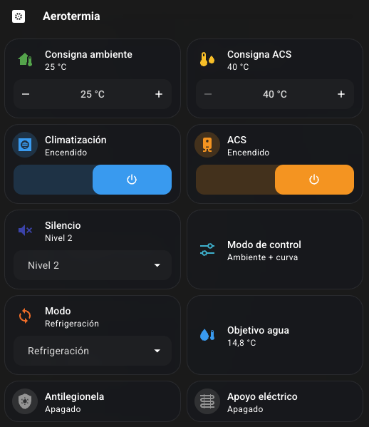

# 5) Entidades y control en Home Assistant — Aerotermia

Cuando adoptas el dispositivo, en Home Assistant te aparecen dos grandes grupos: **cosas que lees** y **cosas que tocas**.

## Lo que lees (sensores)

- **Temperaturas**: agua de entrada (TA) y salida (TB), depósito de inercia (TE1), ACS (TW), batería exterior (T3), ambiente exterior (T4), descarga del compresor (TP), aspiración (TH) y el objetivo de salida de agua (TOut).
- **Circuito frigorífico**: alta y baja presión, corriente y frecuencia del compresor, apertura de la EXV, velocidad del ventilador.
- **Hidráulico**: caudal de agua, PWM y estado de la bomba, válvula de 4 vías, presión de agua.
- **Estado y diagnóstico**: descongelación, anticongelación, retorno de aceite, desinfección… y los **códigos** de avería/protección ya traducidos a texto (ver [4) Códigos E/P](04-codigos-averia-proteccion.md)).

## Lo que tocas (control)

| Entidad | Qué hace |
|---|---|
| **Modo** (select) | Calefacción · Refrigeración · Automático |
| **Climatización** (switch) | Enciende/apaga la producción de clima |
| **ACS** (switch) | Enciende/apaga el agua caliente sanitaria |
| **Consigna calefacción** (number) | Temperatura de agua objetivo en calefacción |
| **Consigna refrigeración** (number) | Temperatura de agua objetivo en refrigeración |
| **Consigna ambiente** (number) | Temperatura ambiente objetivo (para control por curva) |
| **Consigna ACS** (number) | Temperatura objetivo del ACS |
| **Silencio** (select) | Apagado · Nivel 1 · Nivel 2 |
| **Antilegionela** (switch) | Ciclo de desinfección del ACS |
| **Apoyo eléctrico** (switch) | Resistencia eléctrica de apoyo forzada |

### Consigna de agua vs consigna de ambiente

La máquina puede trabajar de dos maneras: fijando la **temperatura del agua** directamente, o fijando la **temperatura ambiente** y dejando que ella calcule el agua con su **curva de compensación** por temperatura exterior. Por eso hay consignas de las dos clases.

Un sensor informativo, **Modo de control**, te dice en cuál está ahora mismo: *agua fija*, *agua + curva*, *ambiente fija* o *ambiente + curva*. Es útil para saber si tocar la "Consigna ambiente" va a tener efecto: si la máquina está en un modo de *agua*, mover la consigna de ambiente no hará nada.

### Un par de avisos

- **Silencio** tiene tres estados (apagado / nivel 1 / nivel 2). El nivel 2 es el más silencioso.
- **Apoyo eléctrico**: consume bastante. Si lo pones en el panel, mételo con confirmación para no darle sin querer.

## Las tarjetas del panel

Este es el panel que uso yo, montado solo con tarjetas *tile* nativas de Home Assistant (sin instalar nada de HACS):



El YAML, para pegarlo en una tarjeta manual (o sección por sección con el editor visual). Los `entity_id` pueden variar según cómo hayas llamado al dispositivo al adoptarlo: compruébalos en **Ajustes → Dispositivos y servicios → ESPHome → Aerotermia** y ajusta.

```yaml
type: grid
columns: 2
square: false
cards:
  - type: tile
    entity: number.aero_consigna_ambiente
    name: Consigna ambiente
    features:
      - type: numeric-input
        style: buttons
  - type: tile
    entity: number.aero_consigna_acs
    name: Consigna ACS
    color: amber
    features:
      - type: numeric-input
        style: buttons
  - type: tile
    entity: switch.aero_climatizacion
    name: Climatización
    features:
      - type: toggle
  - type: tile
    entity: switch.aero_acs
    name: ACS
    color: amber
    features:
      - type: toggle
  - type: tile
    entity: select.aero_silencio
    name: Silencio
    features:
      - type: select-options
  - type: tile
    entity: sensor.aero_modo_de_control
    name: Modo de control
  - type: tile
    entity: select.aero_modo
    name: Modo
    features:
      - type: select-options
  - type: tile
    entity: sensor.aero_temp_objetivo_salida_tout
    name: Objetivo agua
  - type: tile
    entity: switch.aero_desinfeccion_acs
    name: Antilegionela
  - type: tile
    entity: switch.aero_calentador_apoyo
    name: Apoyo eléctrico
```

Detalles del montaje:

- Las dos consignas llevan la función *numeric-input* en modo botones (el − / valor / + que se ve en la captura).
- **Climatización** y **ACS** llevan la función *toggle*; a la de ACS le va bien `color: amber` para distinguir clima de agua caliente.
- **Silencio** y **Modo** usan *select-options*, que mete el desplegable dentro de la propia tarjeta.
- **Antilegionela** y **Apoyo eléctrico** son los switches de desinfección y resistencia de apoyo renombrados en la tarjeta. Al de apoyo, mejor añádele confirmación (`confirmation: true` no existe en tile; hazlo con *tap action → más información* o déjalo sin función de toggle para que no se active de un toque).

---

⬅️ Antes: [4) Códigos de avería y protección](04-codigos-averia-proteccion.md)
